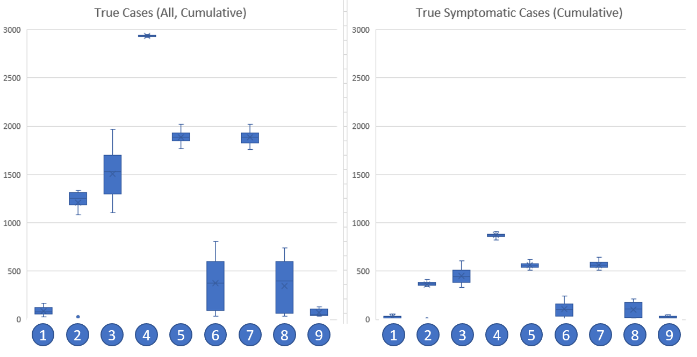

# Experiment: The Interactions Between a Committed Policy Change and Large COVID-19 Outbreak in Unity, Saskatchewan and Surrounding Rural Municipality 

Luminesim Simulation and Analytics  
June 2020  
www.luminesim.com

*This work has not been peer reviewed and is presented solely for the information and interest of the Regional COVID-19 Response Simulation community. **Never change your local COVID-19 response strategy without direct instruction and approval from regional, provincial, and federal health authorities.***

## Overview

This experiment summarizes the results of RCRS in the Unity, Saskatchewan region and surrounding rural municipality of Round Valley No. 410. The effect of different COVID-19 responses is tested in the wake of a large outbreak. The community picks one set of interventions to adhere to regardless of consequences, and the number of **true** cases -- i.e. the number of cases that would be found if 100% of the community was tested -- is recorded and reported.

## Key Takeaways

1. This experiment explores the effect of different COVID-19 policies in a small community when an outbreak strikes.
1. The community members immediately and fully commit to these policies, regardless of outcome. Importantly, this means that if the outbreak worsens individuals will still follow the policies. Results should therefore be interpreted as a projected upper limit of infections for each policy.
1. The true cumulative number of cases is reported, which assumes that 100% test coverage is available and all infections, asymptomatic or symptomatic, are identified.
1. The number of true cases will be substantially higher than what would be reported in the real world: this is in line with [some reports](https://science.sciencemag.org/content/368/6490/489) indicating that up to 86% of cases have gone unreported and substantial numbers are entirely asymptomatic or only mildly symptomatic.

## Method

RCRS is seeded with the population of Unity, SK and Round Valley No. 410 according to 2016 census figures. To avoid confusion with the province's current reopening strategy, counterfactual scenarios are explored where the simulation begins on 15 April 2020. When the simulation starts, an outbreak occurs in all of Unity's employers with at least 10 people followed by a new, random COVID-19 infection each day for the first week of the simulation; this approach is used to reduce sensitivity to initial conditions and ensure an outbreak (e.g. infecting an infant is less likely to trigger an outbreak than infecting someone at one of the town's major grocery stores) while still introducing some randomness into those initially infected. The area's residents are then assigned a COVID-19 response strategy to employ.  The outcomes of each strategy, which are followed immediately and consistently to the end of the simulation, are reported. These strategies are given below. 

Note that the percentages used for each intervention (i.e. intervention strength or efficacy) have been selected by the team; as intervention strength decreases, projected COVID-19 cases are likely to increase. Base parameter values can be found in the central RCRS documentation. For the purpose of this document, "community location" is a catch-all term for workplaces and schools used for any purpose (e.g. working hours, shopping location, social gatherings at after-school activity, etc.).

1. **Continue initial provincial interventions.** This is a continuation of the status quo: schools and non-essential locations (70%) are shut. Individuals reduce within-community travel and gathering to only essential purposes (-80% base rate; travel additionally canceled if destination is closed). Handwashing (-90% risk of infection from surfaces) and surface decontamination at locations is pervasive and frequent (3 times per hour). Social distancing is in effect (-90% risk of exposing others at locations where distancing possible, which excludes schools and homes). Individuals strongly favour staying home when sick (-90% chance of going out when in Symptomatic state). As mask use in the community is anecdotally inconsistent in the community, masks are not assumed to be used. The hospital processing COVID-19 cases, for simplicity designated to be the existing local hospital, is well-stocked for severe cases; while this impacts death rate, the death rate is not explored in this report.
1. **Continue initial provincial interventions, but resume school.** This scenario explores what might happen if schools were reopened. As of writing, the evidence is unclear as to how rapidly youth transmit COVID-19 relative to adults: students are therefore assumed to spread COVID-19 at the same rate as adults. Schools are also assumed to not be capable of enforcing social distancing.
1. **Continue initial provincial interventions, but remove handwashing, sanitization, and social distancing.** This scenario explores what might happen if individual-level prevention standards wane. 
1. **Remove all provincial interventions.** This scenario explores what might happen if community members eschew all interventions, i.e., school resumes, all locations reopen, within-community travel and gathering resumes, going out while sick returns to the base rate, and social distancing, handwashing, and surface decontamination end.
1. **Continue initial provincial interventions, but resume business activity and within-community travel.** This scenario explores what might happen if community locations (excluding schools) reopen to full capacity and residents resume interacting with those locations. 
1. **Continue initial provincial interventions, but resume business activity and within-community travel with masks.** This scenario explores what might happen if community locations (excluding schools) reopen to full capacity and residents resume interacting with those locations *with universal mask usage.* This strategy is explored as many jurisdictions appear to be reducing COVID-19 spread due to widespread mask usage.
1. **Continue initial provincial interventions, but resume business activity, within-community travel, and resume schools.** This scenario explores what might happen if community locations (including schools) and interaction at community locations resumes in full. This strategy is explored as a return to normal with individual-level preventative measures.
1. **Continue initial provincial interventions, but resume business activity, within-community travel, and resume schools with masks** This scenario explores what might happen if community locations (including schools) and interaction at community locations resumes in full *with universal mask usage.* As above, this strategy is explored as a return to normal but with preventative measures supplemented with widespread mask use.
1. **Continue initial provincial interventions, but add masks.** This scenario explores what might happen if initial provincial measures are supplemented with universal mask adoption. As above, this is explored as many jurisdictions appear to be experiencing beneficial outcomes from mask usage.

For simplicity, all community members fully and immediately commit to these policy changes regardless of outcome.

### Simulation Timeline

1. The simulation starts on 15 April 2020. This is used as a counterfactual to avoid confusion with the provincial reopening strategy.
2. COVID-19 strategies change on 15 April 2020 moments after the initial outbreak.
3. The simulation runs for 120 days (i.e. to 13 August 2020).

### Code Version

The model revision used in this experiment is [dev/fe012aaca51207a0bd6fa16d395d0ac2f9f81815](https://github.com/Luminesim/Regional-COVID-19-Response-Simulation/commit/fe012aaca51207a0bd6fa16d395d0ac2f9f81815)

## Results

Results can be seen in the following chart and accompanying data table; each intervention is numbered according to the list in *Method* section.

 

**True Cases (All, Cumulative)**

|Experiment|Mean|Standard Deviation|
|---|---|---|
|1|88.6|39.4|
|2|1209.6|232.6|
|3|1506.7|242.0|
|4|2933.6|6.6|
|5|1883.5|62.4|
|6|374.9|243.1|
|7|1883.2|65.4|
|8|347.7|254.9|
|9|69.4|33.3|

**True Symptomatic Cases (Cumulative)**

|Experiment|Mean|Standard Deviation|
|---|---|---|
|1|26.9|13.8|
|2|360.0|69.3|
|3|450.8|77.8|
|4|873.7|21.4|
|5|559.5|30.4|
|6|106.2|72.7|
|7|566.0|34.9|
|8|98.9|74.5|
|9|22.0|11.2|

## Discussion

Unsurprisingly, the interventions with the least COVID-19 cases were those where current policies are left in place (Scenario 1) or where current policies are supplemented with masks (Scenario 9). The worst performing policy is to remove all interventions (Scenario 4), which, if no response is taken even in light of an outbreak, consumes the entire region. The best strategy for reopening partially or fully includes masks (Scenarios 6 and 8) on top of all existing preventative measures (social distancing, handwashing, surface decontamination), which is in line with existing [studies showing the efficacy of masks](https://arxiv.org/pdf/2004.13553.pdf). In between these extremes lies reopening schools and/or community locations such as businesses (Scenarios 2, 5, and 7) *without* masks, which leaves a much higher risk of widespread outbreak. Similarly, removing preventative measures (Scenario 3) leaves the community open to infection.

The results of retaining all interventions (Scenario 1) is unsurprising. With people largely isolated and heavy prevention in place, COVID-19 has difficulty gaining a foothold in the community. Adding masks (Scenario 9) only marginally improves this specific scenario: since people aren't being infected anyway, masks can only do so little. Scenario 4 -- no interventions -- is similarly unsurprising in that full, unprotected contact in a  community that regularly engages in social contact causes COVID-19 to spread rapidly. While near-100% spread is unlikely in the real world due to likely self-isolation in response to an outbreak, COVID-19 can spread widely even with preventative measures in place. For example, New York City may have more than [20% of their population infected](https://thehill.com/policy/healthcare/494324-27m-new-yorkers-have-had-coronavirus-preliminary-data-shows) despite preventative measures: while the Unity region is clearly not as dense as New York City, [outbreaks in rural USA](https://www.washingtonpost.com/nation/2020/05/24/coronavirus-rural-america-outbreaks/?arc404=true) indicate that density may not be the defining factor in outbreak size.

If stay-at-home policies end, our results indicate that masks may provide substantial benefit (Scenarios 6 and 8). A large outbreak can sometimes be entirely prevented or substantially reduced when compared with the no-mask equivalents (Scenarios 5 and 7). Note, however, that these scenarios explored universal mask usage outside the home: partial mask usage may be substantially less effective.

Continued community vigilance is suggested by simulation results: even with limited contact due to stay-at-home policies, removing social distancing, handwashing, and surface decontamination allows the infection to spread (Scenario 3). Public places allow infection to be acquired, which then spreads in the home, which then reinforces the rate at which infection can be spread and acquired in public places.

Scenario 2 -- the return of schools -- is a result wherein more research is required. Excluding hospitalization and death rates, which are known to be lower for youth, RCRS assumes that the rate of infection spread and development of symptoms is identical for youth and adults. There is a myriad of debate on the subject of youth susceptibility and spread of COVID-19; until this debate is resolved, Scenario 2's results should be interpreted as a pessimistic scenario that warrants continued caution.

As only some COVID-19 infections develop symptoms, the number of symptomatic cases is always smaller than the total number of cases. This has implications for identifying an outbreak in the real world. In these scenarios, we report the true number of cases (symptomatic or otherwise); in the real world, only a subset of these cases are likely to be identified, which, anecdotally, is likely to be skewed towards identifying those with symptoms. A real-world outbreak would therefore be reported with much smaller numbers than the true number of cases, and thus a "small" outbreak identified through incomplete testing of symptomatic people should be taken extremely seriously. [Some sources have suggested that there can be a 1:10 ratio](https://science.sciencemag.org/content/368/6490/489) between the number of reported and actual cases if testing is sparse: 300 positive tests in a region with approximately 3000 people is therefore cause for serious concern. 

## Limitations

The experiment assumes three critical items in addition to the other factors in RCRS: 
1. The community does not rethink its strategy mid-outbreak
1. The community immediately and fully adheres to the strategy 
1. Children experience the same infection dynamics as their parents

As stated in prior sections, these limitations mean results should be interpreted as pessimistic outcomes: rapid self-isolation and closure of non-essential facilities following an outbreak could -- *if rapidly implemented* -- reduce outbreak severity.

While the simulation calculates hospitalization and death rates, we do not report these figures due to the size of the community.

## Conclusion

Our results suggest that there is good reason to be cautious and respond rapidly to a COVID-19 outbreak. By entirely removing the current suite of interventions, an outbreak left unchecked could consume the entire community; by retaining all current interventions, our results suggest that outbreaks are dramatically reduced. As interventions are removed, the risk of a large outbreak increases. Our results also suggest that the addition of masks could counteract this risk assuming they are widely and consistently adopted and properly used. While our results show a large risk in reopening schools, the ongoing debate about how youth develop and spread COVID-19 means that this scenario requires further data to confidently suggest action. If youth *do not* readily spread COVID-19 this may reduce the outbreak size in other scenarios.

## Acknowledgements
We are immensely thankful to those who donated to our [GoFundMe campaign](https://gf.me/u/x28ahx) and the even larger group who shared it. We are able to spend more time on the model thanks to their contributions.

## Conflicts of Interest & Other Notes
We have no conflicts of interest to declare. The Town of Unity was not involved in producing these results nor did it commission them. These results should not be taken as an endorsement from the Town of Unity nor surrounding rural municipalities. These results have not been peer reviewed. **Never change your local COVID-19 response strategy without direct approval from regional, provincial, and federal health authorities.**